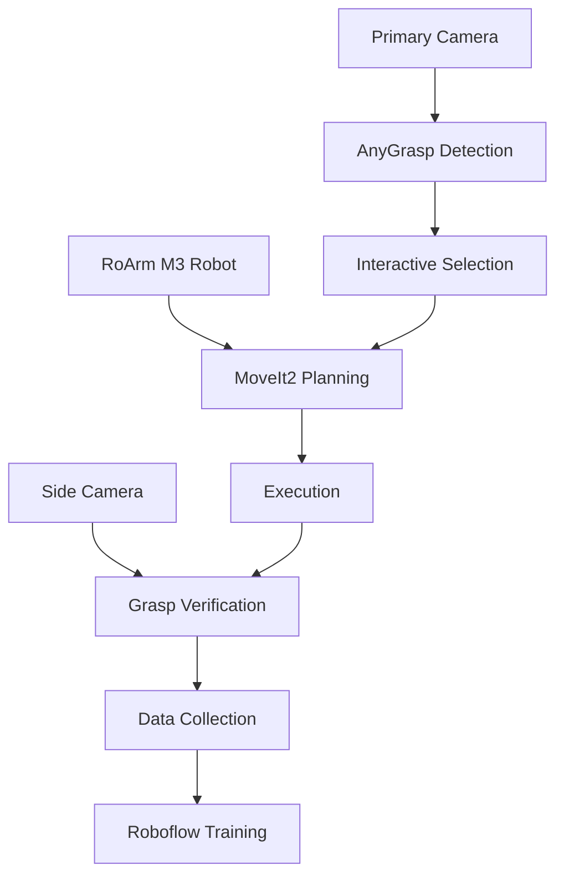

# GitHub Migration & Project Management Plan

## 🎯 **Repository Strategy**

### **Recommended Repository Structure**
```
roarm-m3-intelligent-grasping/
├── 📄 README.md                          # Project overview and quick start
├── 📄 LICENSE                            # Open source license
├── 📄 CONTRIBUTING.md                     # Contribution guidelines
├── 📄 CHANGELOG.md                        # Version history
├── 📄 .gitignore                         # Git ignore patterns
├── 📄 .gitattributes                     # Git LFS configuration
├── 📄 pyproject.toml                     # Python project configuration
├── 📄 requirements.txt                   # Python dependencies
│
├── 📁 .github/                           # GitHub-specific files
│   ├── workflows/                        # CI/CD pipelines
│   │   ├── build-and-test.yml
│   │   ├── docker-build.yml
│   │   └── native-install-test.yml
│   ├── ISSUE_TEMPLATE/                   # Issue templates
│   ├── PULL_REQUEST_TEMPLATE.md
│   └── dependabot.yml                    # Dependency updates
│
├── 📁 src/                               # ROS2 packages
│   ├── roarm_main/                       # Main robot packages
│   ├── roarm_anygrasp_integration/       # AnyGrasp integration
│   ├── realsense_launch/                 # Camera configurations
│   └── roarm_description/                # Robot description
│
├── 📁 config/                            # Configuration files
│   ├── hardware/                         # Hardware configurations
│   ├── calibration/                      # Calibration parameters
│   ├── grasping/                         # Grasping policies
│   └── visualization/                    # Foxglove panels
│
├── 📁 docs/                              # Documentation
│   ├── installation/                     # Installation guides
│   ├── calibration/                      # Calibration procedures
│   ├── user-guide/                       # User documentation
│   ├── developer-guide/                  # Developer documentation
│   └── api/                              # API documentation
│
├── 📁 scripts/                           # Installation and utility scripts
│   ├── install/                          # Installation scripts
│   ├── setup/                            # Environment setup
│   ├── calibration/                      # Calibration utilities
│   └── tools/                            # Development tools
│
├── 📁 launch/                            # Global launch files
│   ├── roarm_complete_system.launch.py
│   ├── calibration_workflow.launch.py
│   └── development.launch.py
│
├── 📁 docker/                            # Docker configurations (legacy)
│   ├── Dockerfile.ros2
│   ├── Dockerfile.anygrasp
│   ├── docker-compose.yml
│   └── README.md
│
├── 📁 tests/                             # Test suites
│   ├── unit/                             # Unit tests
│   ├── integration/                      # Integration tests
│   ├── hardware/                         # Hardware-in-loop tests
│   └── calibration/                      # Calibration validation
│
├── 📁 data/                              # Sample data and models
│   ├── calibration/                      # Sample calibration data
│   ├── grasping/                         # Grasp models and datasets
│   └── visualization/                    # Demo images and videos
│
└── 📁 deployment/                        # Deployment configurations
    ├── native/                           # Native installation
    ├── docker/                           # Docker deployment
    ├── kubernetes/                       # K8s deployment (future)
    └── edge/                             # Edge device deployment
```

## 🚀 **Migration Workflow**

### **Phase 1: Repository Initialization**

#### 1.1 Create Repository Structure
```bash
# Initialize new repository
mkdir roarm-m3-intelligent-grasping
cd roarm-m3-intelligent-grasping
git init

# Create directory structure
mkdir -p .github/workflows .github/ISSUE_TEMPLATE
mkdir -p src config docs scripts launch docker tests data deployment
mkdir -p docs/{installation,calibration,user-guide,developer-guide,api}
mkdir -p scripts/{install,setup,calibration,tools}
mkdir -p tests/{unit,integration,hardware,calibration}
mkdir -p config/{hardware,calibration,grasping,visualization}
mkdir -p deployment/{native,docker,kubernetes,edge}
mkdir -p data/{calibration,grasping,visualization}
```

#### 1.2 Set Up Git LFS (Large File Storage)
```bash
# Install Git LFS
git lfs install

# Track large files
echo "*.bag" >> .gitattributes
echo "*.png" >> .gitattributes
echo "*.jpg" >> .gitattributes
echo "*.jpeg" >> .gitattributes
echo "*.mp4" >> .gitattributes
echo "*.avi" >> .gitattributes
echo "*.pth" >> .gitattributes
echo "*.pkl" >> .gitattributes
echo "*.h5" >> .gitattributes
echo "*.hdf5" >> .gitattributes
echo "calibration/*.json filter=lfs diff=lfs merge=lfs -text" >> .gitattributes
echo "data/** filter=lfs diff=lfs merge=lfs -text" >> .gitattributes

git add .gitattributes
```

#### 1.3 Create Comprehensive .gitignore
```bash
cat > .gitignore << 'EOF'
# ROS2 build artifacts
build/
install/
log/

# Python
__pycache__/
*.py[cod]
*$py.class
*.so
.Python
env/
venv/
.venv/
pip-log.txt
pip-delete-this-directory.txt
.tox/
.coverage
.coverage.*
.cache
nosetests.xml
coverage.xml
*.cover
*.log
.git
.mypy_cache
.pytest_cache
.hypothesis

# C++
*.o
*.so
*.a
*.la
*.lo
*.dylib
*.dll
*.exe

# IDE
.vscode/
.idea/
*.swp
*.swo
*~

# OS
.DS_Store
.DS_Store?
._*
.Spotlight-V100
.Trashes
ehthumbs.db
Thumbs.db

# Temporary files
*.tmp
*.temp
*.bak
*.backup

# Calibration data (store separately)
/tmp/
*.bag
calibration_results_*/

# Secrets and keys
*.key
*.pem
*.p12
.env
secrets.yaml

# Large model files (use Git LFS)
*.pth
*.pkl
*.h5
*.hdf5
models/

# Docker
.dockerignore

# Documentation build
docs/_build/
site/
EOF
```

### **Phase 2: Content Migration**

#### 2.1 Source Code Migration
```bash
# Copy ROS2 packages
cp -r /root/ros2_workspace/src/* ./src/

# Copy configuration files
cp -r /root/ros2_workspace/config/* ./config/ 2>/dev/null || echo "No config dir found"

# Copy documentation
cp /root/ros2_workspace/*.md ./docs/
cp /root/ros2_workspace/CALIBRATION_README.md ./docs/calibration/
cp /root/ros2_workspace/DOCKER_REMOVAL_PLAN.md ./docs/installation/

# Copy Docker files to legacy directory
cp /root/ros2_workspace/Dockerfile ./docker/Dockerfile.ros2
cp /root/ros2_workspace/docker-compose.yml ./docker/
```

#### 2.2 Create Installation Scripts
```bash
# Native installation script
cat > scripts/install/install_native_ubuntu22.sh << 'EOF'
#!/bin/bash
set -e

echo "🤖 Installing RoArm M3 Intelligent Grasping System - Native Ubuntu 22.04"

# Install ROS2 Humble
./install_ros2_humble.sh

# Install hardware drivers
./install_hardware_drivers.sh

# Install Python dependencies
./install_python_deps.sh

# Setup workspace
./setup_workspace.sh

echo "✅ Installation complete!"
EOF

chmod +x scripts/install/install_native_ubuntu22.sh
```

#### 2.3 Create CI/CD Pipelines
```yaml
# .github/workflows/build-and-test.yml
name: Build and Test

on:
  push:
    branches: [ main, develop ]
  pull_request:
    branches: [ main, develop ]

jobs:
  build-native:
    runs-on: ubuntu-22.04
    strategy:
      matrix:
        ros_distro: [humble]
    
    steps:
    - uses: actions/checkout@v4
      with:
        lfs: true
    
    - name: Setup ROS2 ${{ matrix.ros_distro }}
      uses: ros-tooling/setup-ros@v0.7
      with:
        required-ros-distributions: ${{ matrix.ros_distro }}
    
    - name: Install dependencies
      run: |
        sudo apt update
        rosdep update
        rosdep install --from-paths src --ignore-src -r -y
    
    - name: Build workspace
      run: |
        source /opt/ros/${{ matrix.ros_distro }}/setup.bash
        colcon build --symlink-install
    
    - name: Run tests
      run: |
        source /opt/ros/${{ matrix.ros_distro }}/setup.bash
        source install/setup.bash
        colcon test
        colcon test-result --verbose

  build-docker:
    runs-on: ubuntu-22.04
    steps:
    - uses: actions/checkout@v4
      with:
        lfs: true
    
    - name: Build Docker image
      run: |
        cd docker
        docker build -t roarm-m3:latest -f Dockerfile.ros2 .
    
    - name: Test Docker container
      run: |
        docker run --rm roarm-m3:latest bash -c "source /opt/ros/humble/setup.bash && ros2 pkg list | grep roarm"

  documentation:
    runs-on: ubuntu-22.04
    steps:
    - uses: actions/checkout@v4
    
    - name: Setup Python
      uses: actions/setup-python@v4
      with:
        python-version: '3.10'
    
    - name: Install docs dependencies
      run: |
        pip install mkdocs mkdocs-material pymdown-extensions
    
    - name: Build documentation
      run: |
        mkdocs build
    
    - name: Deploy to GitHub Pages
      if: github.ref == 'refs/heads/main'
      uses: peaceiris/actions-gh-pages@v3
      with:
        github_token: ${{ secrets.GITHUB_TOKEN }}
        publish_dir: ./site
```

### **Phase 3: Documentation Creation**

#### 3.1 Project README
```markdown
# RoArm M3 Intelligent Grasping System

[](https://github.com/username/roarm-m3-intelligent-grasping/actions)
[](https://opensource.org/licenses/Apache-2.0)
[](https://docs.ros.org/en/humble/)

An intelligent robotic grasping system combining the RoArm M3 6-DOF robot arm with dual Intel RealSense cameras, AnyGrasp detection, and interactive user workflows.

## ✨ Features

- 🤖 **Interactive Grasping**: User selects from top 5 grasp candidates
- 📸 **Dual Camera System**: Primary detection + side verification cameras
- 🎯 **ChArUco Calibration**: Professional camera calibration workflow
- 🌐 **Web Interface**: Foxglove Studio integration for remote control
- 📊 **Data Collection**: Automatic Roboflow integration for ML training
- 🔧 **Modular Design**: Docker and native installation options

## 🚀 Quick Start

### Docker (Recommended for beginners)
```bash
git clone https://github.com/username/roarm-m3-intelligent-grasping.git
cd roarm-m3-intelligent-grasping
docker-compose up
```

### Native Installation (Ubuntu 22.04)
```bash
git clone https://github.com/username/roarm-m3-intelligent-grasping.git
cd roarm-m3-intelligent-grasping
./scripts/install/install_native_ubuntu22.sh
```

## 📖 Documentation

- [Installation Guide](docs/installation/)
- [Calibration Procedures](docs/calibration/)
- [User Guide](docs/user-guide/)
- [Developer Guide](docs/developer-guide/)
- [API Reference](docs/api/)

## 🎬 Demo


## 🏗️ System Architecture



## 🤝 Contributing

See [CONTRIBUTING.md](CONTRIBUTING.md) for guidelines.

## 📄 License

This project is licensed under the Apache 2.0 License - see [LICENSE](LICENSE) file.
```

#### 3.2 Installation Documentation
Create comprehensive installation guides for different deployment scenarios:
- Native Ubuntu 22.04 installation
- Docker deployment guide  
- Hardware setup and calibration
- Troubleshooting common issues

### **Phase 4: Backup Strategy**

#### 4.1 Git Repository Backup
```bash
# Multiple remote repositories for redundancy
git remote add origin https://github.com/username/roarm-m3-intelligent-grasping.git
git remote add backup https://gitlab.com/username/roarm-m3-intelligent-grasping.git
git remote add mirror https://bitbucket.org/username/roarm-m3-intelligent-grasping.git

# Push to all remotes
git push origin main
git push backup main  
git push mirror main
```

#### 4.2 Data Backup Strategy
```bash
# Calibration data backup
git lfs track "calibration/*.json"
git lfs track "data/calibration/*"

# Model and training data
git lfs track "models/*.pth"
git lfs track "data/grasping/*"

# Large media files
git lfs track "docs/**/*.mp4"
git lfs track "data/visualization/*"
```

#### 4.3 Automated Backup Script
```bash
#!/bin/bash
# scripts/tools/backup_project.sh

BACKUP_DIR="/backup/roarm-m3/$(date +%Y%m%d_%H%M%S)"
mkdir -p "$BACKUP_DIR"

# Git repository backup
git bundle create "$BACKUP_DIR/roarm-m3-repo.bundle" --all

# Configuration backup
tar -czf "$BACKUP_DIR/workspace_config.tar.gz" config/

# Calibration data backup
tar -czf "$BACKUP_DIR/calibration_data.tar.gz" data/calibration/

# Documentation backup
tar -czf "$BACKUP_DIR/documentation.tar.gz" docs/

echo "Backup completed: $BACKUP_DIR"
```

## 🎯 **Migration Timeline**

### **Week 1: Repository Setup**
- [x] Create GitHub repository structure
- [x] Set up Git LFS for large files
- [x] Create initial CI/CD pipelines
- [x] Migrate source code and documentation

### **Week 2: Native Installation**
- [ ] Create native installation scripts
- [ ] Test on clean Ubuntu 22.04 system  
- [ ] Document hardware setup procedures
- [ ] Validate calibration workflows

### **Week 3: Testing & Documentation**
- [ ] Comprehensive testing of native installation
- [ ] Performance benchmarking vs Docker
- [ ] Complete user and developer documentation
- [ ] Create video tutorials

### **Week 4: Production Deployment**
- [ ] Production-ready deployment scripts
- [ ] Monitoring and logging setup
- [ ] Backup and recovery procedures
- [ ] Team training and handover

## 🔍 **Risk Mitigation**

1. **Keep Docker as fallback**: Maintain Docker option during transition
2. **Progressive migration**: Move components incrementally
3. **Automated testing**: Ensure quality throughout migration
4. **Multiple backups**: Git + cloud + local backups
5. **Documentation**: Comprehensive guides for all scenarios

This migration plan provides a solid foundation for moving from Docker-based development to a GitHub-managed project with flexible deployment options.